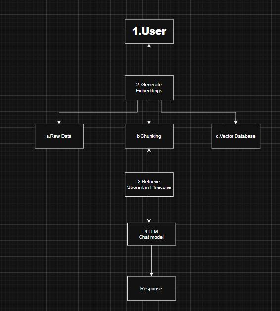

## Bajaj Tech Chatbot — RAG-based Financial Assistant

This repository implements a RAG-powered Financial Chatbot built for querying the Bajaj Finserv AMC Fund Factsheet (Oct 2025).

It uses LangChain, LLMs (GPT/Gemini), Pinecone, and Flask to deliver accurate, fact-grounded answers directly from the uploaded factsheet.

---

## Features  

- Conversational **Bajaj Tech Chatbot** with Gemini
- **Context-aware responses** using Pinecone vector DB for embeddings  
- **LangChain** framework for chaining LLM tasks  
- **Flask-based API & Web UI**  

---

## Tech Stack  

- **Programming Language:** Python  
- **Frameworks:** LangChain, Flask  
- **LLMs:** OpenAI GPT  
- **Vector DB:** Pinecone   

---

## Installation  

Follow the steps below to set up the project locally.  

### 1. Clone the Repository  

```bash
cd bajaj
```

### 2. Create Virtual Environment  

```bash
python -m venv bajaj
# Activate environment
source bajaj/Scripts/activate
```

### 3. Install Requirements  

```bash
pip install -r requirements.txt
```

### 4. Setup Environment Variables  

Create a `.env` file in the root directory:  

```ini
PINECONE_API_KEY = "your-pinecone-api-key"
GOOGLE_API_KEY = "your-google-api-key"
```

---

##  Store Embeddings  

Run the following command to generate and store embeddings in Pinecone:  

```bash
python store_index.py
```
## Workflow 

---

## Run the Application  

```bash
python app.py
```

Now, open your browser and visit:  

```
http://127.0.0.1:5000
```


